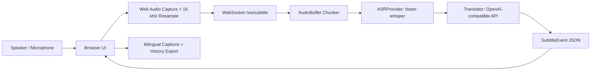
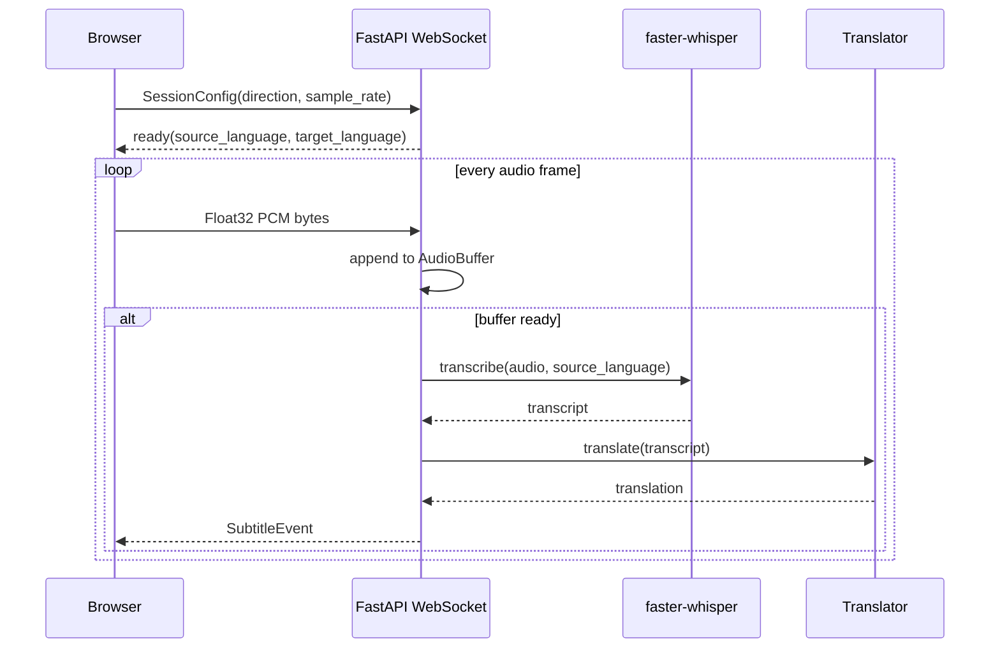
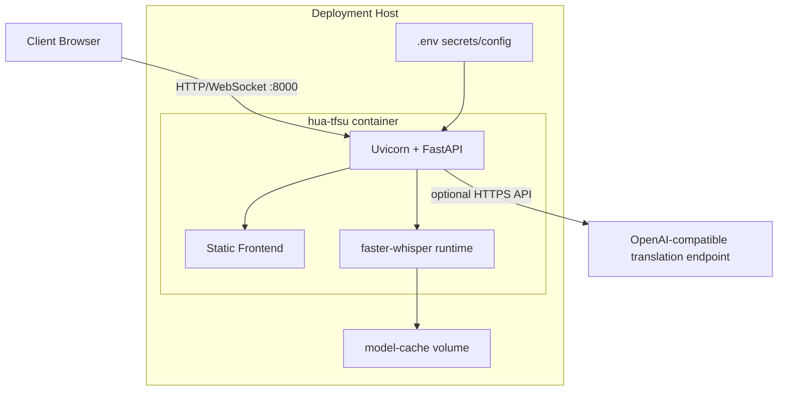

# Hua-TFSU 实时同传字幕平台设计方案

生成日期：2026-05-24

## 1. GitHub 调研结论

以 GitHub star 数作为“评分最高”的量化口径，并限定在实时字幕、实时语音转写、同传翻译相关项目。已将源码包拉取到本地 `references/`。

| 排名 | 项目 | Stars | 技术方向 | 可借鉴点 | 对 Hua-TFSU 的启发 |
| --- | --- | ---: | --- | --- | --- |
| 1 | [collabora/WhisperLive](https://github.com/collabora/WhisperLive) | 4043 | WebSocket 实时 Whisper 服务 | 多后端 faster-whisper/TensorRT/OpenVINO、客户端连接管理、VAD、Docker | MVP 采用 WebSocket + faster-whisper，后续保留 GPU/TensorRT 优化接口 |
| 2 | [ufal/whisper_streaming](https://github.com/ufal/whisper_streaming) | 3623 | 将 Whisper 改造为低延迟流式 ASR/翻译 | LocalAgreement、VAC/VAD、长语音自适应延迟 | 后续在当前分片策略上升级为确认/未确认字幕双缓冲，降低“回改”感 |
| 3 | [ufal/SimulStreaming](https://github.com/ufal/SimulStreaming) | 601 | 同步 ASR + LLM 翻译 | Whisper STT 与 LLM text-to-text 解耦，面向同传任务 | 当前系统拆分 ASRProvider 与 Translator，便于替换为本地 LLM 或专用同传模型 |

## 2. 产品目标

Hua-TFSU 的第一阶段目标是可部署、可演示、可继续扩展：

- 输入：浏览器麦克风实时音频。
- 输出：听写字幕、目标语翻译字幕、字幕历史、JSON 导出。
- 方向：英中、 中英。
- 部署：Docker Compose 单服务部署，后续可拆 ASR/翻译为独立服务。
- 延迟目标：CPU 环境 2-6 秒可用，GPU 环境 1-3 秒优化。

## 3. 功能模块

| 模块 | 当前实现 | 后续增强 |
| --- | --- | --- |
| 前端采集 | Web Audio API 采集麦克风，重采样为 16 kHz Float32 PCM | AudioWorklet 替换 ScriptProcessor，增加系统音频/会议软件音频入口 |
| 实时传输 | WebSocket 二进制音频分片 + JSON 结果事件 | 心跳、重连、会话鉴权、房间广播 |
| ASR 听写 | faster-whisper，按方向指定 `en` 或 `zh` | 流式 LocalAgreement、热词、说话人分离、GPU 批处理 |
| 翻译 | OpenAI-compatible Chat Completions | 专用术语库、同传短句策略、本地 LLM/机器翻译后端 |
| 字幕展示 | 双栏显示、波形、历史、导出 | OBS overlay、SRT/WebVTT 实时生成、审校工作台 |
| 部署 | Dockerfile + docker-compose | GPU compose、Kubernetes、监控、日志归档 |

## 4. 系统架构图



## 5. 实时处理时序



## 6. 部署工程图



## 7. 当前代码结构

```text
Hua-TFSU/
  backend/app/
    main.py          FastAPI HTTP/WebSocket 入口
    audio.py         音频缓冲与分片
    asr.py           faster-whisper ASRProvider
    translator.py    OpenAI-compatible 翻译接口
    languages.py     英中/中英方向映射
    schemas.py       会话与字幕事件模型
  frontend/
    index.html       实时字幕界面
    app.js           麦克风采集、WebSocket、字幕渲染
    styles.css       操作台样式
  docs/design.md     本设计方案
  references/        三个参考项目源码
  Dockerfile
  docker-compose.yml
```

## 8. 关键工程决策

- 先采用“浏览器采集 + 后端推理”的 B/S 架构，降低 Windows/macOS 客户端安装成本。
- ASR 与翻译用接口隔离，避免后续替换模型时改动 WebSocket 协议。
- 首阶段使用固定短音频分片，优先跑通可部署闭环；下一阶段引入 LocalAgreement，区分 confirmed 与 unconfirmed 字幕。
- 翻译使用 OpenAI-compatible API，便于切换 OpenAI、Azure OpenAI、私有网关或本地兼容服务。
- Docker 镜像内置 ffmpeg/libgomp，减少 faster-whisper 部署缺依赖的问题。

## 9. 下一阶段路线

1. 引入 AudioWorklet，降低浏览器采集线程抖动。
2. 增加 confirmed/unconfirmed 字幕协议，吸收 WhisperStreaming 的稳定前缀策略。
3. 增加术语表和会前材料上下文，提升课堂/会议专名翻译稳定性。
4. 增加 GPU Docker Compose 与压力测试脚本。
5. 增加用户、房间、权限、录音归档和字幕审校。
